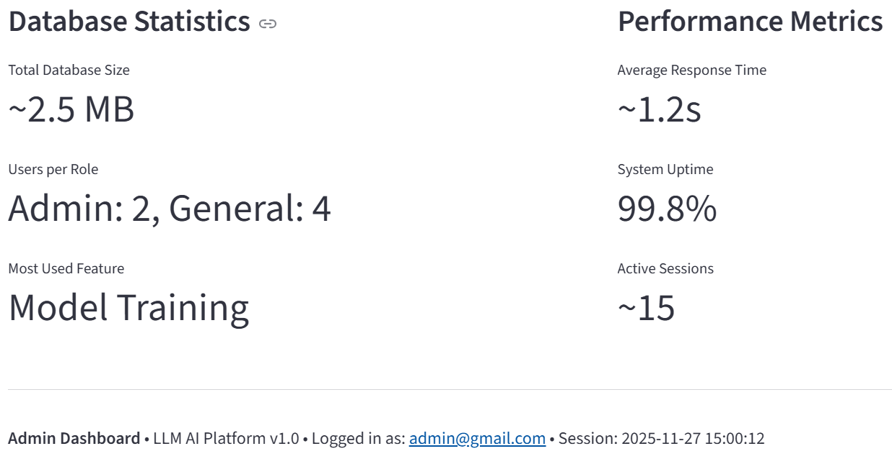
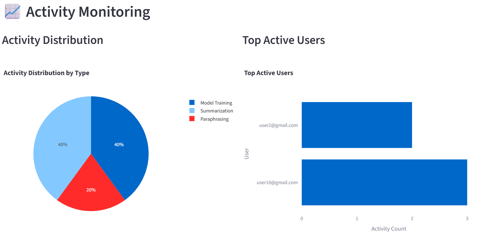
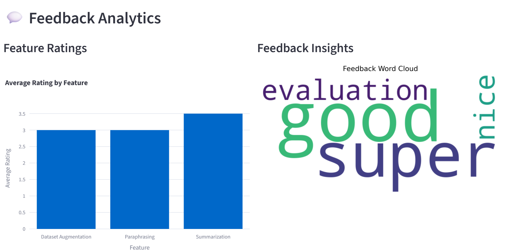
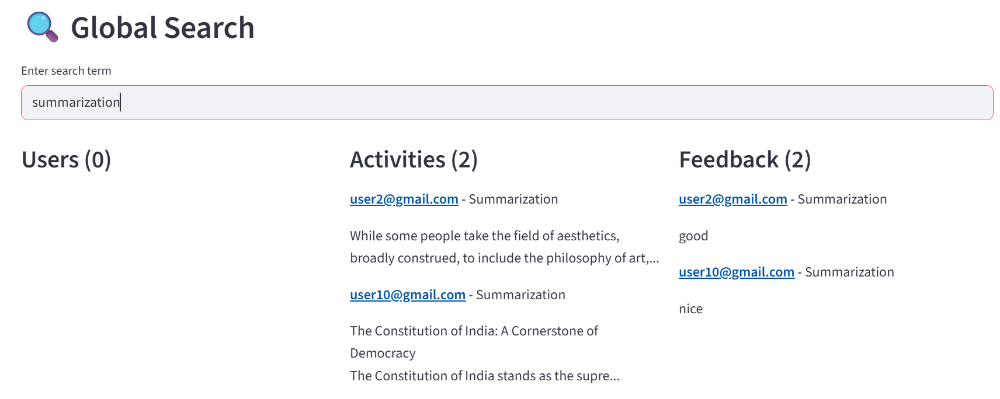
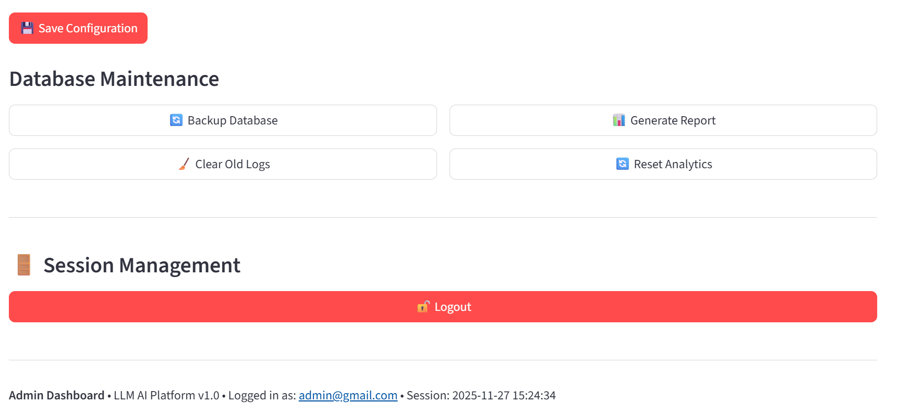
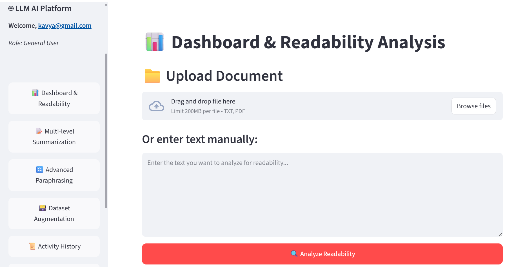

# 🧠 TextMorph

**AI-Powered Content Simplification, Summarization & Paraphrasing Suite**

Transforming complex content into clear, concise, and accessible communication.

## 🔗 Quick Links

| Category | Link |
|----------|------|
| 📽️ Demo Video | https://drive.google.com/file/d/1W88llT4h0k3I8ujctPHxQ6lYo_KVcDOI/view?usp=sharing |
| 🧩 Source Code | This Repository |
| 🐳 Docker Support | Yes |
| 🧠 AI Models | Pegasus · BART · FLAN-T5 · T5 |

## 🎯 About the Project

TextMorph is an advanced AI-powered platform that transforms complex textual content into simplified, summarized, and paraphrased versions. Built with state-of-the-art transformer models, it provides comprehensive readability analysis and content adaptation capabilities for various user needs.

### Problem Statement & Motivation

In today's information-rich world, users face challenges with:
- **Complex Content**: Technical documents, academic papers, and legal texts are often difficult to understand
- **Information Overload**: Extracting key insights from lengthy documents is time-consuming
- **Accessibility Barriers**: Content isn't always optimized for different reading levels
- **Language Complexity**: Need for content adaptation across different proficiency levels

TextMorph addresses these challenges by providing intelligent text transformation tools that make content more accessible and actionable.

## ✨ Key Features

### 🎯 Core Capabilities
- **Multi-level Summarization**: Generate concise summaries at different length levels
- **Advanced Paraphrasing**: Rewrite content with varying complexity and style
- **Readability Analysis**: Comprehensive scoring using 5+ readability metrics
- **Dataset Augmentation**: Tools for custom model training and fine-tuning

### 🔐 User Management
- **Role-based Access**: Admin and General User roles
- **Secure Authentication**: JWT-based authentication with security questions
- **Activity Tracking**: Comprehensive user activity monitoring
- **Feedback System**: Integrated user feedback collection

### 📊 Analytics & Monitoring
- **Real-time Dashboard**: User metrics and system analytics
- **Activity Monitoring**: Track user interactions and model usage
- **Feedback Analytics**: Sentiment analysis and rating trends
- **Admin Controls**: Comprehensive system administration

## 🏗 Architecture

## 🛠 Tech Stack

### Frontend
- **Streamlit** - Web application framework
- **Plotly** - Interactive visualizations
- **Matplotlib** - Static visualizations
- **WordCloud** - Text visualization

### Backend
- **Python 3.8+** - Core programming language
- **SQLite** - Database management
- **JWT** - Authentication tokens
- **bcrypt** - Password hashing

### AI/ML
- **Transformers** - HuggingFace model integration
- **PyTorch** - Deep learning framework
- **NLTK** - Natural language processing
- **SentencePiece** - Tokenization

### Deployment
- **Docker** - Containerization
## 🤖 Models Used

| Model | Company | Parameters | Purpose | Key Features |
|-------|---------|------------|---------|--------------|
| **BART** (facebook/bart-large-cnn) | Meta AI | 400M | Summarization | Denoising autoencoder, excellent for abstractive summarization |
| **T5** (t5-small) | Google | 140M | Paraphrasing | Text-to-text framework, versatile for multiple tasks |
| **Pegasus** (google/pegasus-cnn_dailymail) | Google | 568M | Summarization | Pre-training with gap sentences, great for news summarization |
| **FLAN-T5** (google/flan-t5-base) | Google | 250M | Summarization | Instruction-tuned version, better following user instructions |

### Model Performance Characteristics

- **BART**: Best for balanced summarization with good coherence
- **T5**: Excellent for paraphrasing and text transformation tasks
- **Pegasus**: Superior for extractive-style summarization
- **FLAN-T5**: Better at following specific user instructions

## 🚀 Installation & Setup

### Prerequisites

- Python 3.8 or higher
- 4GB+ RAM (8GB recommended for optimal performance)
- 2GB+ free disk space for models

  ### 🔧 HuggingFace Model Setup

The application uses pre-trained models from HuggingFace. Here's how to set them up:

#### Step 1: Create HuggingFace Account
1. Go to [huggingface.co](https://huggingface.co)
2. Click "Sign Up" and create your account
3. Verify your email address

#### Step 2: Access Required Models
Visit these model pages to accept terms and enable downloads:

| Model | HuggingFace URL |
|-------|----------------|
| **BART** | `https://huggingface.co/sshleifer/distilbart-cnn-12-6` |
| **T5** | `https://huggingface.co/t5-small` |
| **Pegasus** | `https://huggingface.co/google/pegasus-cnn_dailymail` |
| **FLAN-T5** | `https://huggingface.co/google/flan-t5-base` |

**For each model:**
1. Visit the model URL above
2. Click "Agree and access repository"
3. The model will now be accessible for download

#### Step 3: Automatic Download
The application will automatically download models on first use. No manual download required!

### 🌐 Ngrok Setup for Public Access

To expose your local deployment to the internet:

#### Step 1: Create Ngrok Account
1. Go to [ngrok.com](https://ngrok.com)
2. Click "Sign Up" and create your account
3. Verify your email address

#### Step 2: Get Your Auth Token
1. Login to your Ngrok dashboard
2. In the left sidebar, click on "Your Authtoken"
3. Copy your authtoken (starts with `2...`)

#### Step 3: Install and Configure Ngrok

**On Windows:**
1. Download ngrok from [ngrok.com/download](https://ngrok.com/download)
2. Unzip the file
3. Open Command Prompt in the ngrok directory
4. Run: `ngrok config add-authtoken YOUR_AUTH_TOKEN`

## ⚙ Admin Controls

The Admin Dashboard provides comprehensive system administration capabilities with the following features:

### 👥 User Management
- **View All Users**: Complete list of registered users with email, role, and activity details
- **User Search & Filter**: Search users by email and filter by role (Admin/General User)
- **Role Management**: Change user roles between Admin and General User
- **User Deletion**: Remove users from the system (with safety checks)
- **Admin Limit Enforcement**: Maximum 2 admin users allowed for security

### 📊 System Analytics & Metrics
#### Real-time Dashboard
- **User Statistics**: Total users, active users (30 days), new users this month
- **Activity Metrics**: Total activities, activity types distribution
- **Feedback Overview**: Total feedback submissions, average ratings
- **Role Distribution**: Admin vs General User counts

#### Performance Monitoring
- **Database Statistics**: Size estimates and performance metrics
- **System Uptime**: Availability tracking
- **Response Times**: Average processing times
- **Session Management**: Active session tracking

### 📈 Activity Monitoring
#### Activity Tracking
- **Comprehensive Logs**: All user activities with timestamps
- **Activity Types**: Summarization, Paraphrasing, Model Training, etc.
- **Input/Output Preview**: View original inputs and AI-generated outputs
- **Model Usage Tracking**: Which models are being used by which users

#### Advanced Filtering
- **Activity Type Filter**: Filter by specific activity types
- **User Filter**: View activities by specific users
- **Model Filter**: Filter by AI model used
- **Time Range Filter**: Filter by date ranges

#### User Activity Analytics
- **Top Active Users**: Users with highest activity counts
- **Activity Distribution**: Pie charts showing activity type distribution
- **Trend Analysis**: Usage patterns over time

### 💬 Feedback Analytics
#### Feedback Management
- **All Feedback View**: Complete list of user feedback submissions
- **Rating Analysis**: Average ratings per feature
- **Comment Review**: Read user comments and suggestions
- **Feature-specific Feedback**: Filter feedback by platform features

#### Sentiment Analysis
- **Word Cloud Generation**: Visual representation of common feedback themes
- **Rating Trends**: Track satisfaction scores over time
- **Feature Performance**: Identify strongest and weakest features

#### Feedback Processing
- **Search & Filter**: Find specific feedback by content or user
- **Export Capabilities**: Download feedback data for analysis
- **Response Tracking**: Monitor feedback resolution status

### 🔍 Global Search
- **Cross-platform Search**: Search across users, activities, and feedback simultaneously
- **Real-time Results**: Instant search results with categorization
- **Preview Functionality**: Quick preview of search results
- **Comprehensive Coverage**: Search all database tables and text fields

### ⚙ System Configuration
#### Application Settings
- **User Limits**: Configure maximum number of users allowed
- **Session Management**: Set session timeout durations
- **Default Roles**: Configure default user role for new registrations
- **Theme Settings**: Light/Dark/Auto theme selection

#### System Maintenance
- **Database Backup**: Initiate manual database backups
- **Log Management**: Clear old activity logs with retention settings
- **Report Generation**: Create system usage reports
- **Analytics Reset**: Reset analytics data (with confirmation)

### 🔒 Security & Access Control
#### Authentication Management
- **JWT Token Validation**: Secure token-based authentication
- **Role-based Access**: Granular permissions based on user roles
- **Security Question Management**: Admin oversight of security settings

#### Audit Trail
- **Complete Activity Logging**: Every admin action is logged
- **Change Tracking**: Track all modifications to user accounts and settings
- **Access Monitoring**: Monitor who accesses admin features
- **Security Events**: Log security-related events and anomalies

### 📱 Admin User Experience
#### Data Visualization
- **Interactive Charts**: Clickable charts and graphs

- **Real-time Metrics**: Live updating performance indicators

## 👤 User Features

TextMorph provides comprehensive text processing capabilities for general users with the following features:

### 📊 Dashboard & Readability Analysis

- **File Upload Support**: Upload TXT files for analysis
- **Manual Text Input**: Paste text directly for instant analysis
- **Comprehensive Readability Scoring**: 5 different readability metrics
- **Visual Analytics**: Interactive charts and gauge visualizations
- **Text Interpretation**: Automated reading level assessment

#### Readability Metrics
- **Flesch Reading Ease**: Score text readability from 0-100
- **Flesch-Kincaid Grade Level**: US school grade level equivalent
- **Gunning Fog Index**: Years of formal education needed
- **SMOG Index**: Simple Measure of Gobbledygook
- **Coleman-Liau Index**: Based on characters instead of syllables

### 📝 Multi-level Summarization

- **Multiple Length Options**: Short, Medium, and Long summaries
- **Model Selection**: Choose between BART, Pegasus, and FLAN-T5 models
- **Side-by-Side Comparison**: View original text and summary simultaneously
- **History Tracking**: Save and review previous summarization sessions
- **Feedback System**: Rate summaries and provide comments

### 🔄 Advanced Paraphrasing Engine

- **Complexity Levels**: Simple, Neutral, and Advanced paraphrasing
- **Style Options**: Simplification, Formalization, and Creative rewriting
- **Model Flexibility**: T5 and BART model support
- **Real-time Processing**: Instant paraphrasing results
- **Comparison View**: Original vs paraphrased text display

#### Paraphrasing Features
- **Vocabulary Adaptation**: Adjust word complexity automatically
- **Sentence Restructuring**: Improve sentence flow and structure
- **Style Preservation**: Maintain original meaning while changing expression
- **Grammar Enhancement**: Automatic grammar correction

### 🗃️ Dataset Augmentation & Custom Model Tuning

- **Pre-loaded Datasets**: WikiAuto, Newsela, and ASSET datasets
- **Model Training Interface**: Custom model fine-tuning
- **Training Configuration**: Epochs, batch size, learning rate controls
- **Performance Metrics**: Loss, accuracy, and BLEU score tracking
- **Progress Monitoring**: Real-time training progress visualization
#### Training Options
- **Model Architectures**: T5-Small, BART-Base, FLAN-T5
- **Hyperparameter Tuning**: Customizable training parameters
- **Dataset Selection**: Choose from multiple text simplification datasets

### 📜 Activity History

- **Comprehensive Logging**: All user activities automatically recorded
- **Search & Filter**: Find specific activities by type or date
- **Input/Output Preview**: Review previous text processing results
- **Model Usage Tracking**: See which models were used for each task
- **Timeline View**: Chronological activity display

#### History Features
- **Activity Types**: Summarization, Paraphrasing, Readability Analysis
- **Date Range Filtering**: Filter by specific time periods

### 💬 User Feedback System

- **Feature-specific Feedback**: Rate individual platform features
- **Star Rating System**: 1-5 star rating scale
- **Detailed Comments**: Provide specific suggestions and feedback
- **Anonymous Option**: Optional anonymous feedback submission
- **Response Tracking**: See when feedback is addressed

#### Feedback Categories
- **Summarization Quality**: Rate summary accuracy and usefulness
- **Paraphrasing Effectiveness**: Evaluate rewriting quality
- **Interface Usability**: Comment on user experience

### 👤 User Profile Management

- **Account Information**: View email, role, and membership details
- **Security Settings**: Change password and security questions
- **Login History**: Track account access times and dates
- **Password Management**: Secure password change with verification
- **Security Question Setup**: Custom security questions for account recovery

### 🔐 Authentication & Security

- **Secure Login**: JWT token-based authentication
- **Role-based Access**: Different features for Admin vs General users
- **Security Questions**: Additional account recovery protection
- **Password Recovery**: Secure password reset process

#### Security Features
- **Encrypted Storage**: BCrypt password hashing
- **Session Timeout**: Automatic session expiration
- **Account Protection**: Multiple security layers
- **Access Control**: Feature restrictions based on user role

### 🔄 Real-time Processing

- **Instant Results**: Most operations complete in seconds
- **Progress Tracking**: Live progress bars for model loading
- **Queue Management**: Efficient task processing
- **Performance Optimization**: Optimized for speed and reliability

### 📚 Datasets Information

| Dataset | Size | Content Type | Source | Key Features | Use Cases |
|---------|------|--------------|--------|--------------|-----------|
| **WikiAuto** | 100,000+ sentence pairs | Complex-Simple sentence alignments | Wikipedia edits | - Automatically aligned simplifications - Quality filtered pairs - Multiple complexity levels - Diverse topics coverage | - Text simplification training - Readability improvement - Vocabulary adaptation |
| **Newsela** | 50,000+ articles | Multi-level news articles | Newsela platform | - 5 reading levels per article - Professional editorial quality - Current events coverage - Educational focus | - Multi-level summarization - Reading level adaptation - Educational applications |
| **ASSET** | 10,000+ sentences | High-quality simplifications | Human annotated | - Multiple reference simplifications - Expert human annotators - High quality benchmarks - Diverse simplification strategies | - Model evaluation - Quality benchmarking - Training data augmentation |

### 🎯 Model Performance Characteristics

#### Summarization Models
- **BART**: Best for balanced summarization with good coherence and speed
- **Pegasus**: Superior for extractive-style summarization, especially news content
- **FLAN-T5**: Better at following specific user instructions and length constraints

#### Paraphrasing Models
- **T5**: Excellent for text transformation tasks with style and complexity control
- **BART**: Good for creative rewriting and vocabulary adaptation

### 🔧 Technical Specifications

#### Model Input/Output
| Model | Max Input Length | Output Length | Supported Tasks |
|-------|-----------------|---------------|----------------|
| **BART** | 1024 tokens | 30-200 tokens | Summarization, Paraphrasing |
| **T5** | 512 tokens | Flexible | Paraphrasing, Text simplification |
| **Pegasus** | 1024 tokens | 50-250 tokens | Summarization |
| **FLAN-T5** | 512 tokens | Flexible | Summarization, Instruction following |

#### Performance Metrics
| Model | Inference Speed | Memory Usage | Quality Score |
|-------|----------------|--------------|---------------|
| **BART** | ⭐⭐⭐⭐ | ⭐⭐⭐ | 8.5/10 |
| **T5** | ⭐⭐⭐⭐⭐ | ⭐⭐⭐⭐ | 8.0/10 |
| **Pegasus** | ⭐⭐⭐ | ⭐⭐ | 9.0/10 |
| **FLAN-T5** | ⭐⭐⭐⭐ | ⭐⭐⭐ | 8.7/10 |

### 📈 Dataset Statistics

#### WikiAuto Dataset
- **Total Pairs**: 100,000+
- **Average Source Length**: 25 words
- **Average Target Length**: 20 words
- **Complexity Reduction**: 25-40%
- **Quality Score**: 85% human evaluation

#### Newsela Dataset
- **Articles**: 10,000+ original articles
- **Reading Levels**: 5 levels per article (2nd grade to 12th grade)
- **Vocabulary Range**: 5,000 to 25,000 words
- **Topic Coverage**: News, Science, History, Arts

#### ASSET Dataset
- **Sentences**: 10,000+ complex sentences
- **References**: 10 simplifications per sentence
- **Annotators**: 5+ human experts per sentence
- **Quality**: 95% human evaluation score

### 🎮 Use Case Recommendations

#### For Quick Summarization
- **Recommended Model**: BART
- **Reason**: Fast inference, good coherence
- **Best For**: General documents, emails, reports

#### For High-Quality Summaries
- **Recommended Model**: Pegasus
- **Reason**: Highest quality output
- **Best For**: News articles, research papers, important documents

#### For Text Simplification
- **Recommended Model**: T5
- **Reason**: Excellent vocabulary adaptation
- **Best For**: Educational content, accessibility, non-native speakers

#### For Instruction Following
- **Recommended Model**: FLAN-T5
- **Reason**: Best at following specific user commands
- **Best For**: Custom length requirements, specific style requests
## 👥 Team

| Team Member |  Contributions |
|-------------|------|
| **Jey Harshini** | - | 
| **Vijaya Sri Vyshnavi Devi** | - |
| **Likitha Lakamraju** | - |
| **Kushagra Hada** | - |
| **Manasa Mateti** | - |

### 🌟 Acknowledgments

We extend our gratitude to:
- **HuggingFace** for providing pre-trained models and transformers library
- **Streamlit** for the excellent web application framework
- **Open-source community** for continuous support and contributions
- **Our beta testers** for valuable feedback and suggestions

---

## 📄 License

### 🆓 MIT License

**TextMorph** is released under the **MIT License**, making it free and open-source for everyone.
